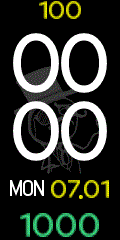
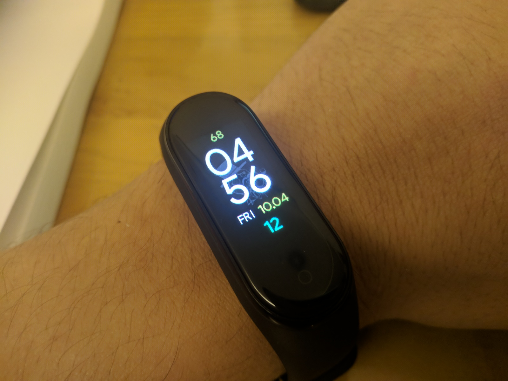

## My custom minimalist watch face for Mi Band 4

Since most of Watch Face you find online have excessive use of background wallpaper and icons, I just use regcnizable important number on my watch face. I only use sleep assistant/sleep control so no need to see heart rate data on the default 

  

__note__: The design was intentionally expanded to fill OLED screen. In reality, when you use on Mi Band with black screen, your display surface looks a little bit bigger.

